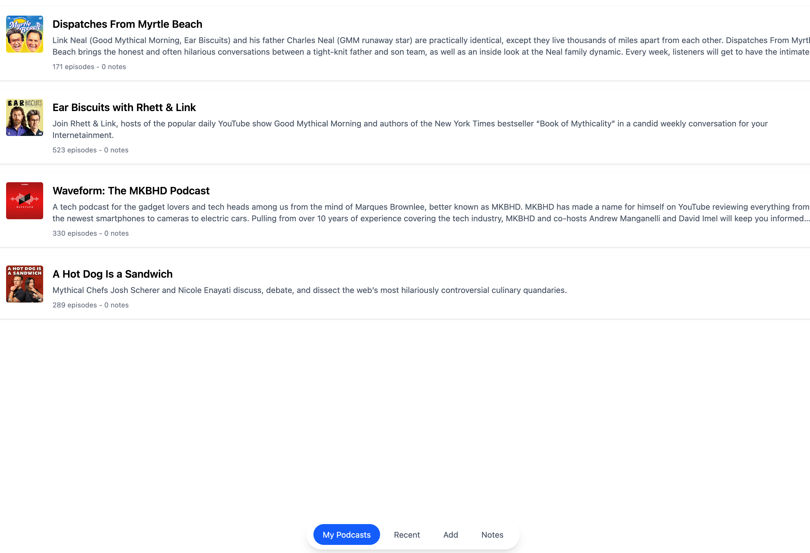
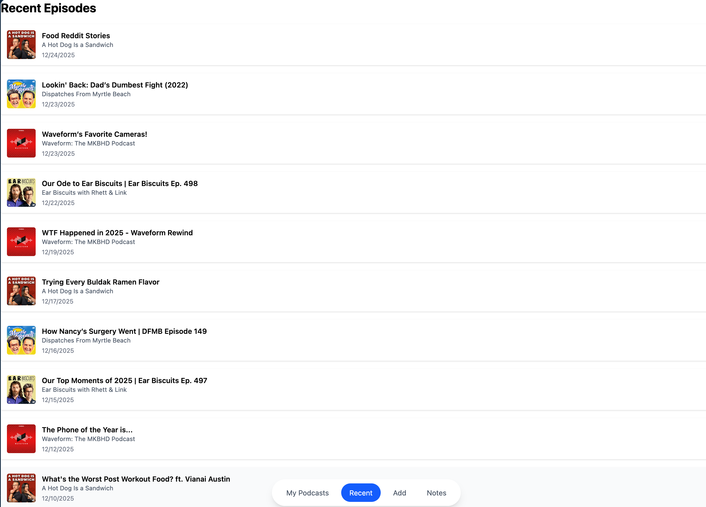
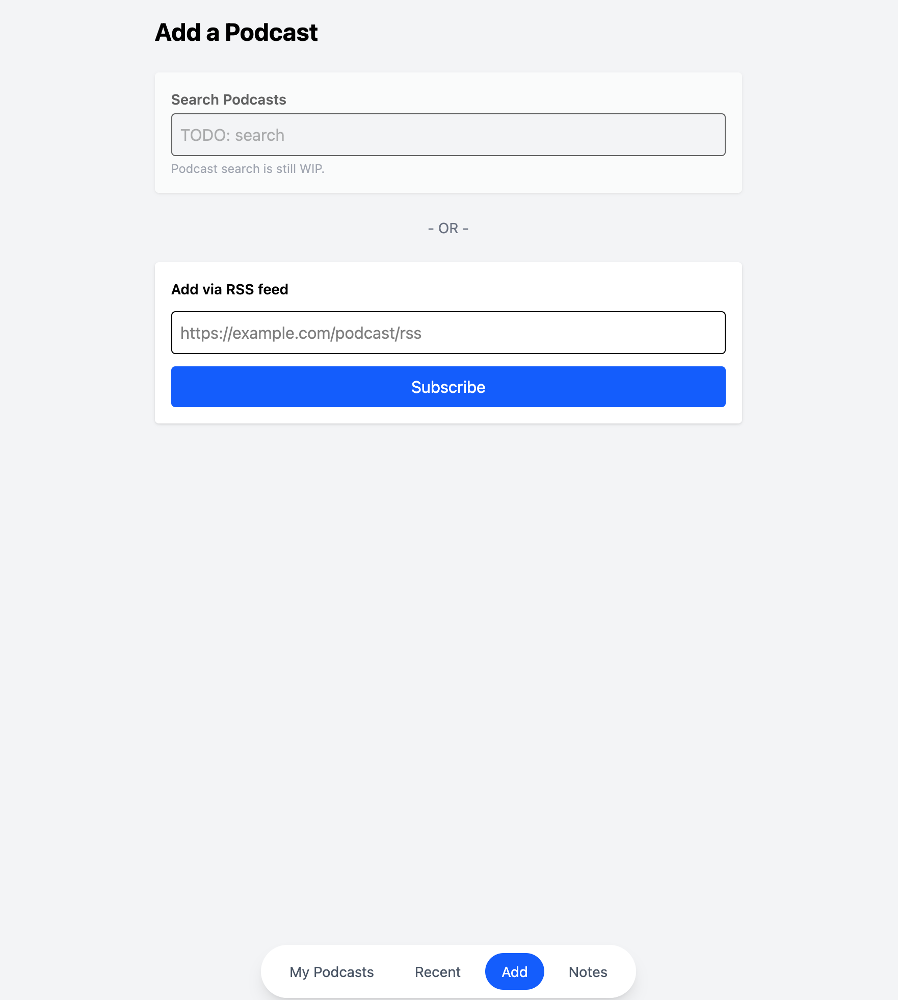
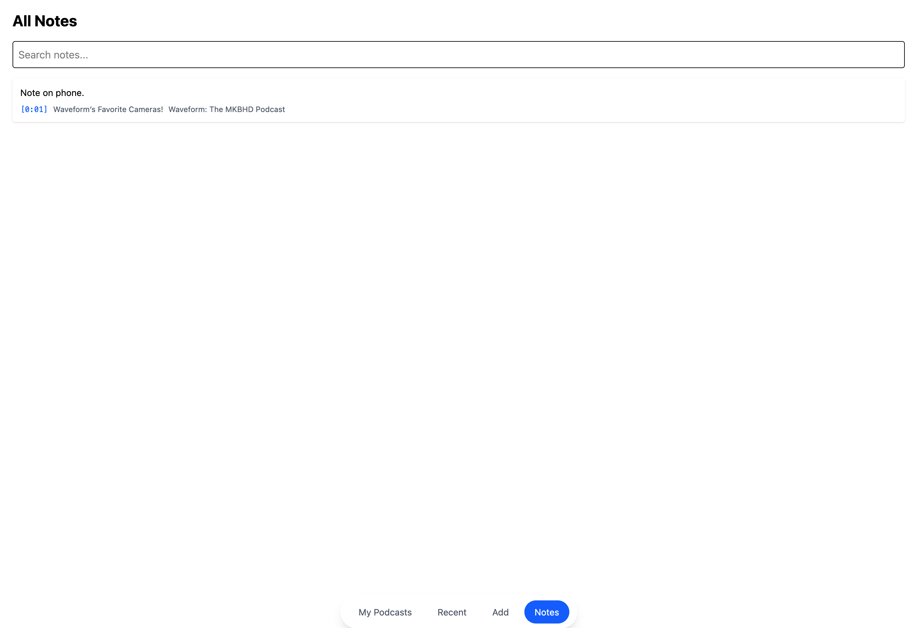

# Podcast Notes App

A full-stack podcast player focused on fast, frictionless note-taking while listening.  
The app lets you subscribe to podcasts via RSS, play episodes with a global mini-player, and attach timestamped notes that are easy to revisit later.

---

## Why This Project Exists

I often listen to podcasts where interesting ideas, references, or insights come up unexpectedly.  
Most podcast apps make note-taking slow, awkward, or disconnected from playback.

This project exists to solve that problem:

- Take notes **while listening**, without breaking focus
- Attach notes to **exact timestamps**
- Quickly jump back to the moment a note refers to
- Keep notes organized across podcasts and episodes

The goal is to make podcast listening more active and reflective, not passive.

---

## Core Features

- Subscribe to podcasts via RSS
- Podcast library view
- Recent episodes view
- Global mini-player that persists across views
- Play / pause, seek, skip, and playback speed control
- Timestamped episode notes
- Podcast-wide notes
- Edit and delete notes
- Notes search across all podcasts and episodes
- Progressive Web App (PWA) support

---

## Screenshots

### On Desktop






### On iOS


---

## Tech Stack

### Frontend

- React (Vite)
- Tailwind CSS
- Fetch API
- Service Worker (PWA support)

### Backend

- Node.js
- Express
- Prisma
- PostgreSQL
- RSS Parser

### Hosting

- Frontend: Vercel
- Backend API: Render
- Database: PostgreSQL (hosted)

---

## Project Structure

```
/
├── server.js
├── routes/
├── controllers/
├── services/
├── prisma/
│   └── schema.prisma
├── frontend/
│   ├── src/
│   │   ├── views/
│   │   ├── components/
│   │   ├── api.js
│   │   └── App.jsx
│   └── public/
└── README.md
```

---

## Local Development

### Prerequisites

- Node.js 18+
- PostgreSQL
- npm or pnpm

### Backend Setup

```
npm install
npx prisma migrate dev
npm run dev
```

The backend will run on `http://localhost:3000`.

### Frontend Setup

```
cd frontend
npm install
npm run dev
```

The frontend will run on `http://localhost:5173`.

---

## Environment Variables

### Backend

```
DATABASE_URL=postgresql://...
PORT=3000
```

### Frontend

```
VITE_API_BASE_URL=http://localhost:3000
```

---

## Design Decisions

- **RSS-first**: No platform lock-in, works with any podcast feed
- **Global mini-player**: Playback should never stop when navigating
- **Notes are first-class**: Notes are searchable and navigable, not an afterthought
- **Timestamp-based notes**: Notes are tied to moments, not just episodes
- **Separation of concerns**: Clear split between controllers, services, and views

---

## Future Ideas

- Podcast search (beyond RSS)
- Offline playback and notes sync
- Note export (Markdown / PDF)
- Tagging notes
- Full-text search indexing
- Cross-device sync improvements

---

## License

MIT
